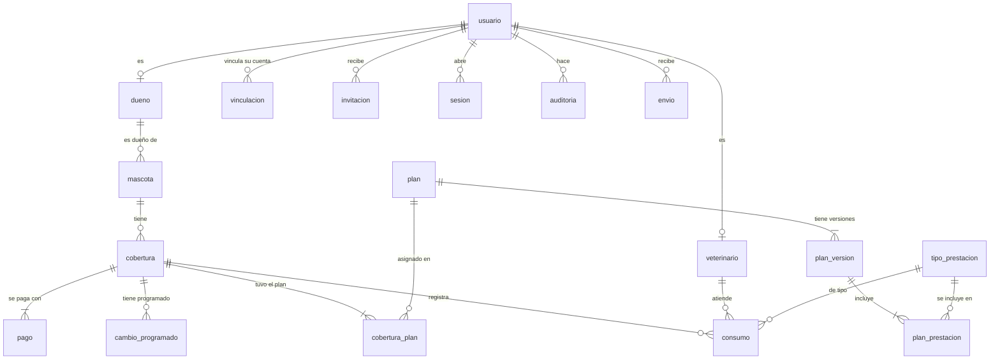
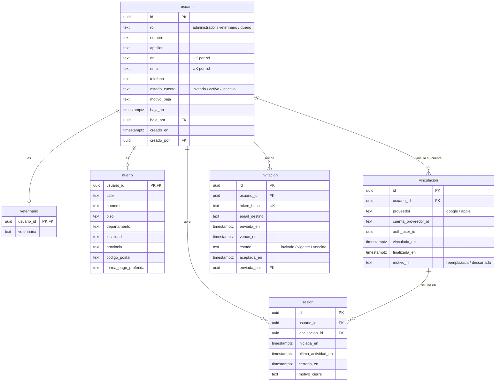
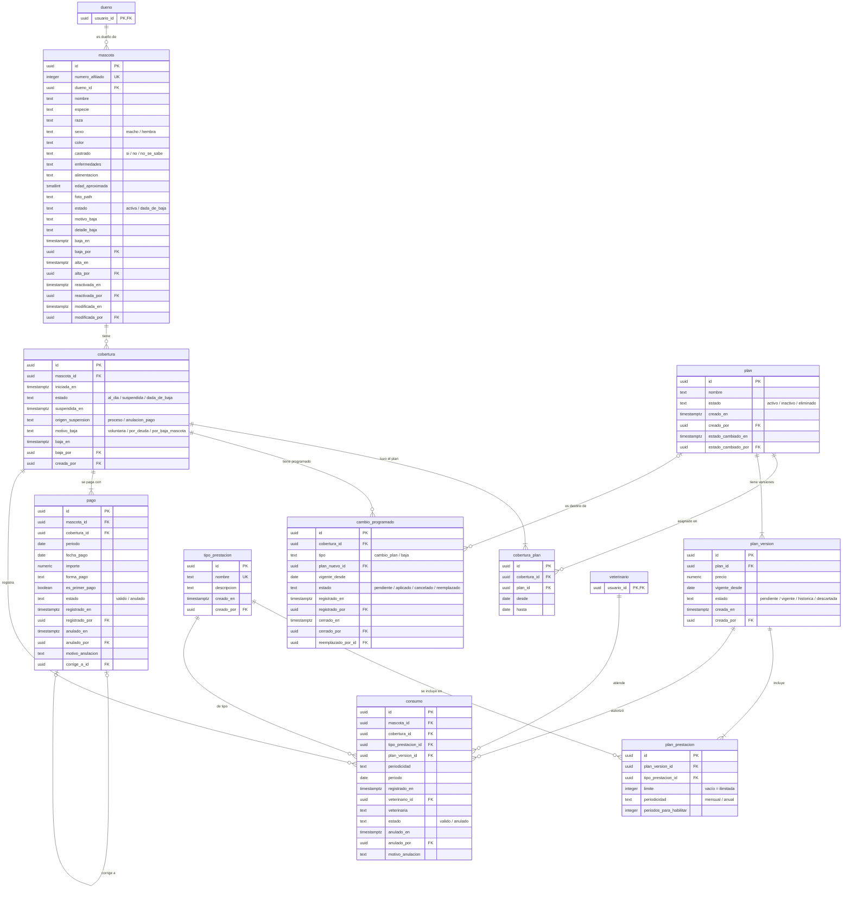
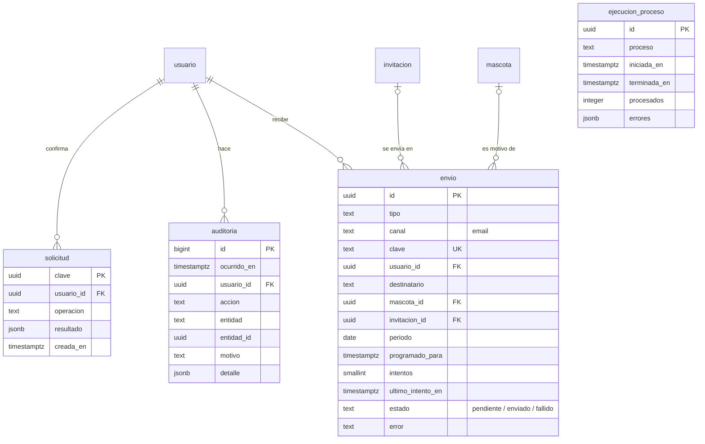

# Modelo de datos — WildSalud

Modelo de datos del sistema completo, derivado de los casos de uso de [casos-de-uso/](casos-de-uso/README.md),
de los requisitos de [proyecto.md](proyecto.md) y de las decisiones de [decisiones.md](decisiones.md).

> Estado: borrador para revisar. Todavía no hay SQL: se escribe a partir de este modelo una vez aprobado.

## Cómo leer este documento

- **Base de datos:** PostgreSQL (Supabase). Los tipos de las columnas son los de PostgreSQL.
- **Nombres:** tablas y columnas en español, en minúscula y con guion bajo, sin tildes ni ñ (`dueno`, `numero_afiliado`).
- **Identificadores internos:** cada tabla tiene un `id` de tipo `uuid` que el sistema nunca muestra (D45). Los identificadores de negocio (número de afiliado, DNI) son columnas aparte.
- **Valores de una lista fija** (estados, motivos, formas de pago): se guardan como `text` con una restricción que admite solo los valores de la lista. Es más fácil de cambiar que un tipo `enum` de PostgreSQL.
- **Fechas y horas:** `timestamptz` para momentos (se muestran en hora de Argentina, D53) y `date` para fechas sin hora.
- **Períodos:** se guardan como `date` con el **día 1 del mes** (`2026-10-01` es el período `2026-10`, D1). Para un período anual, el 1 de enero.
- **Dinero:** `numeric(12,2)`, en pesos. Nunca `float`, porque redondea.
- **Borrado lógico:** nada se borra físicamente (RNF-BAJ-01). Las bajas cambian un estado y guardan fecha, responsable y motivo.
- **"Sistema":** cuando una columna `..._por` (quién lo hizo) está vacía en algo que hizo un proceso automático, el responsable es *Sistema*.
- **Etapa:** cada tabla indica si se crea en la **v1** (la entrega para la veterinaria) o en la **v1.1**.

## Diagrama general

Las tablas y cómo se relacionan, sin columnas. Los diagramas de cada área, más abajo, muestran las columnas.

Además, `ejecucion_proceso` y `solicitud` no se relacionan con el resto en el diagrama: registran las corridas de los procesos automáticos y evitan operaciones duplicadas.

## Personas y acceso

### `usuario` — v1

Una fila por cuenta de acceso. Los datos comunes a los tres roles están acá; los propios de cada rol, en `veterinario` y `dueno` (ver [M-01](#m-01-usuario-con-subtipos-por-rol)).

| Columna | Tipo | Obligatoria | Reglas | Origen |
|---------|------|-------------|--------|--------|
| `id` | uuid | Sí | Clave primaria. | D45 |
| `rol` | text | Sí | `administrador`, `veterinario` o `dueno`. No cambia nunca. | RF-ROL-03, D46 |
| `nombre`, `apellido` | text | Sí | | RF-VET-01, RF-DUE-01 |
| `dni` | text | Sí, salvo administradores | 7 u 8 dígitos, sin puntos. Único **dentro de cada rol**, incluidos los dados de baja. | D44, D80, D82 |
| `email` | text | Sí | Guardado en minúsculas. Único dentro de cada rol, incluidos los dados de baja. | D80, D81 |
| `telefono` | text | Sí, salvo administradores | Con código de área. | D75, D80 |
| `estado_cuenta` | text | Sí | `invitado`, `activo` o `inactivo`. Arranca en `invitado`. | D47, D97 |
| `motivo_baja` | text | Si está `inactivo` | Texto libre. Se vacía al reactivar; la baja anterior queda en la auditoría. | D98, CU-07, CU-11 |
| `baja_en`, `baja_por` | timestamptz, uuid → `usuario` | Si está `inactivo` | Fecha y hora de la baja y administrador. Se vacían al reactivar. | RNF-BAJ-04 |
| `creado_en`, `creado_por` | timestamptz, uuid → `usuario` | `creado_por` no | `creado_por` vacío: administrador cargado por configuración. | D50, D112 |

### `veterinario` — v1

| Columna | Tipo | Obligatoria | Reglas | Origen |
|---------|------|-------------|--------|--------|
| `usuario_id` | uuid → `usuario` | Sí | Clave primaria. El usuario tiene rol `veterinario`, o `administrador` si también atiende como veterinario. | D145 |
| `veterinaria` | text | Sí | Texto, no una entidad. | D13 |

### `dueno` — v1

| Columna | Tipo | Obligatoria | Reglas | Origen |
|---------|------|-------------|--------|--------|
| `usuario_id` | uuid → `usuario` | Sí | Clave primaria. El usuario tiene que tener rol `dueno`. | |
| `calle`, `numero`, `localidad`, `provincia`, `codigo_postal` | text | Sí | Dirección estructurada. | D75, D80 |
| `piso`, `departamento` | text | No | | D75, D80 |
| `forma_pago_preferida` | text | Sí | `efectivo`, `transferencia`, `tarjeta_debito` o `tarjeta_credito`. Se propone por defecto al registrar un pago. | D7, D59 |

### `vinculacion` — v1

La cuenta de Google o Apple con la que entra cada usuario. Se guarda el historial: cuando se reemplaza o se descarta, la fila anterior se cierra y se crea otra.

| Columna | Tipo | Obligatoria | Reglas | Origen |
|---------|------|-------------|--------|--------|
| `id` | uuid | Sí | Clave primaria. | |
| `usuario_id` | uuid → `usuario` | Sí | Un usuario tiene **una sola vinculación abierta** (`finalizada_en` vacía). | D37 |
| `proveedor` | text | Sí | `google` o `apple`. | D24 |
| `cuenta_proveedor_id` | text | Sí | Identificador de la cuenta en el proveedor. Una misma cuenta no puede estar en dos vinculaciones abiertas, **aunque el usuario esté dado de baja** (queda reservada). | D89, D97 |
| `auth_user_id` | uuid | Sí | Usuario de Supabase Auth que corresponde a esa cuenta (ver [M-10](#m-10-supabase-auth)). | |
| `vinculada_en` | timestamptz | Sí | | CU-01 |
| `finalizada_en`, `motivo_fin` | timestamptz, text | No | `reemplazada` (el usuario vinculó otra cuenta con un reenvío) o `descartada` (reactivación). | D91, D97 |

### `invitacion` — v1

| Columna | Tipo | Obligatoria | Reglas | Origen |
|---------|------|-------------|--------|--------|
| `id` | uuid | Sí | Clave primaria. | |
| `usuario_id` | uuid → `usuario` | Sí | Un usuario tiene **como máximo una invitación en estado `invitado`**: al crear otra, las anteriores pasan a `vencida`. | D87 |
| `token_hash` | text | Sí | Único. Se guarda el *hash* del código del enlace, nunca el código, para que alguien con acceso a la base no pueda usar las invitaciones. | D37 |
| `email_destino` | text | Sí | | CU-12 |
| `enviada_en`, `vence_en` | timestamptz | Sí | `vence_en` = `enviada_en` + 24 horas. | D87 |
| `estado` | text | Sí | `invitado`, `vigente` o `vencida`. El vencimiento por tiempo se calcula en el momento con `vence_en`; no hace falta un proceso que lo cambie. | D111, CU-12 |
| `aceptada_en` | timestamptz | No | | CU-01 |
| `enviada_por` | uuid → `usuario` | No | Vacío: invitación de la configuración inicial. | D112 |

### `sesion` — v1

Supabase maneja los tokens de sesión; esta tabla agrega lo que pide WildSalud y Supabase no resuelve solo: vencer a las 4 horas sin actividad y cerrar sesiones cuando se reemplaza una cuenta.

| Columna | Tipo | Obligatoria | Reglas | Origen |
|---------|------|-------------|--------|--------|
| `id` | uuid | Sí | Clave primaria. | |
| `usuario_id` | uuid → `usuario` | Sí | El rol de la sesión es el del usuario. | CU-02 RN-04 |
| `vinculacion_id` | uuid → `vinculacion` | Sí | Indica con qué proveedor entró. | CU-02 |
| `iniciada_en`, `ultima_actividad_en` | timestamptz | Sí | Vencida si pasaron 4 horas desde `ultima_actividad_en`. | D90 |
| `cerrada_en`, `motivo_cierre` | timestamptz, text | No | `cierre_usuario`, `inactividad`, `cuenta_reemplazada`, `baja` u `otra_invitacion`. | CU-03, D91, D93 |

## Mascotas, planes, coberturas, pagos y consumos

### `mascota` — v1

| Columna | Tipo | Obligatoria | Reglas | Origen |
|---------|------|-------------|--------|--------|
| `id` | uuid | Sí | Clave primaria. | D45 |
| `numero_afiliado` | integer | Sí | Único, correlativo, lo asigna una secuencia de la base al confirmar el alta (dos altas simultáneas nunca reciben el mismo). Se muestra con 6 dígitos (`000125`). Nunca se reutiliza ni cambia. | D23, D102, CU-13 RN-09 |
| `dueno_id` | uuid → `dueno` | Sí | Un único dueño. Se puede cambiar editando la mascota. | RF-MAS-02, D119 |
| `nombre`, `especie` | text | Sí | Especie en texto libre. | D103 |
| `sexo` | text | Sí | `macho` o `hembra`. | D103 |
| `castrado` | text | Sí | `si`, `no` o `no_se_sabe`. | D103 |
| `edad_aproximada` | smallint | Sí | Entero de 0 a 30, en años, tal como se cargó (su fecha es `alta_en`). | D41, D103 |
| `raza`, `color`, `enfermedades`, `alimentacion` | text | No | | RF-MAS-01, D103 |
| `foto_path` | text | No | Ruta del archivo en Supabase Storage (el JPG reducido). Al cambiarla, la ruta anterior queda en la auditoría y el archivo no se borra. | D114, CU-14 |
| `estado` | text | Sí | `activa` o `dada_de_baja`. | CU-15, CU-51 |
| `motivo_baja` | text | Si está dada de baja | `fallecimiento`, `pedido_dueno`, `otro` o `baja_dueno`. Con `fallecimiento` no se puede reactivar. | D100, D106, D116 |
| `detalle_baja` | text | Si el motivo es `otro` | | D106 |
| `baja_en`, `baja_por` | timestamptz, uuid → `usuario` | Si está dada de baja | Se vacían al reactivar; la baja anterior queda en la auditoría. | RNF-BAJ-04 |
| `alta_en`, `alta_por` | timestamptz, uuid → `usuario` | Sí | | CU-13 |
| `reactivada_en`, `reactivada_por` | timestamptz, uuid → `usuario` | No | Última reactivación. | CU-51 |
| `modificada_en`, `modificada_por` | timestamptz, uuid → `usuario` | No | Última edición. | CU-14 |

### `tipo_prestacion` — v1

| Columna | Tipo | Obligatoria | Reglas | Origen |
|---------|------|-------------|--------|--------|
| `id` | uuid | Sí | Clave primaria. | |
| `nombre` | text | Sí | Hasta 40 caracteres. Único sin distinguir mayúsculas ni acentos. No se dan de baja. En la v1 la tabla **arranca vacía** y el administrador crea los suyos con CU-20 ([alcance-v1.md](alcance-v1.md)); D31 prevé arrancar con los 7 del documento. | D31, D132, D133 |
| `descripcion` | text | No | Hasta 200 caracteres. | D132 |
| `creado_en`, `creado_por` | timestamptz, uuid → `usuario` | Sí | Administrador que lo creó. | CU-20 |

### `plan` — v1

Lo que no cambia con las versiones: el nombre y el estado.

| Columna | Tipo | Obligatoria | Reglas | Origen |
|---------|------|-------------|--------|--------|
| `id` | uuid | Sí | Clave primaria. | |
| `nombre` | text | Sí | Único entre los planes **no eliminados**, sin distinguir mayúsculas ni acentos. Cambia en el momento, sin versión nueva. | D126, D128, D134 |
| `estado` | text | Sí | `activo`, `inactivo` o `eliminado`. Solo se elimina un plan inactivo que ninguna cobertura vigente tenga. | D21, D134, D136, D137 |
| `creado_en`, `creado_por` | timestamptz, uuid → `usuario` | Sí | | CU-16 |
| `estado_cambiado_en`, `estado_cambiado_por` | timestamptz, uuid → `usuario` | No | Último cambio de estado. | CU-18, CU-19, CU-52 |

### `plan_version` — v1

Las condiciones del plan (precio y prestaciones) en cada momento. Editar un plan no modifica la versión vigente: crea una **pendiente** que rige desde el 1 del mes siguiente (ver [M-05](#m-05-versiones-de-plan)).

| Columna | Tipo | Obligatoria | Reglas | Origen |
|---------|------|-------------|--------|--------|
| `id` | uuid | Sí | Clave primaria. | |
| `plan_id` | uuid → `plan` | Sí | Un plan tiene **una sola versión vigente** y **como máximo una pendiente**. | D127 |
| `precio` | numeric(12,2) | Sí | Mayor que cero. Cuota mensual. | D126 |
| `vigente_desde` | date | Sí | Primera versión: la fecha de creación del plan. Las siguientes: el día 1 del mes siguiente a la edición. | RF-PLA-06, D56 |
| `estado` | text | Sí | `pendiente`, `vigente`, `historica` o `descartada`. | CU-17, CU-46, CU-52 |
| `creada_en`, `creada_por` | timestamptz, uuid → `usuario` | Sí | | CU-16, CU-17 |

### `plan_prestacion` — v1

Cada prestación incluida en una versión del plan.

| Columna | Tipo | Obligatoria | Reglas | Origen |
|---------|------|-------------|--------|--------|
| `id` | uuid | Sí | Clave primaria. | |
| `plan_version_id` | uuid → `plan_version` | Sí | Cada versión tiene al menos una prestación. | D126 |
| `tipo_prestacion_id` | uuid → `tipo_prestacion` | Sí | Un tipo no se repite dentro de la misma versión. | D126 |
| `limite` | integer | No | Mayor que cero. Vacío: ilimitada. | D32, D126 |
| `periodicidad` | text | Sí | `mensual` o `anual`. | RF-PLA-01 |
| `periodos_para_habilitar` | integer | Sí | 1 o más. Con 1 está habilitada desde el primer pago. | RF-PLA-09, D126 |

### `cobertura` — v1

Cada vez que una mascota tiene plan es una cobertura. Una baja cierra la cobertura; volver a asignar un plan crea una nueva, con antigüedad 0 (D9).

| Columna | Tipo | Obligatoria | Reglas | Origen |
|---------|------|-------------|--------|--------|
| `id` | uuid | Sí | Clave primaria. | |
| `mascota_id` | uuid → `mascota` | Sí | Una mascota tiene **como máximo una cobertura no dada de baja**. | D10 |
| `iniciada_en` | timestamptz | Sí | Momento del alta con su primer pago. | D2, D3 |
| `estado` | text | Sí | `al_dia`, `suspendida` o `dada_de_baja`. Se guarda para consultar rápido, pero el sistema **lo recalcula en cada operación** con la fecha y los pagos (ver [M-02](#m-02-estado-de-la-cobertura-guardado-y-recalculado)). | D16, D54 |
| `suspendida_en` | timestamptz | Si está suspendida | Comienzo de la suspensión actual. De acá se cuentan los 3 meses para la baja por deuda; un pago parcial no lo cambia. Se vacía al reactivarse. | D8, D67 |
| `origen_suspension` | text | Si está suspendida | `proceso` (día 14) o `anulacion_pago`. | CU-28, CU-44 |
| `motivo_baja` | text | Si está dada de baja | `voluntaria`, `por_deuda` o `por_baja_mascota`. | D16 |
| `baja_en`, `baja_por` | timestamptz, uuid → `usuario` | `baja_en` si está dada de baja | `baja_por` vacío: la dio de baja un proceso (*Sistema*). | CU-45, CU-46 |
| `creada_por` | uuid → `usuario` | Sí | | CU-22 |

### `cobertura_plan` — v1

Qué plan tuvo la cobertura en cada momento. Hace falta porque el precio de cada período es el del plan que la cobertura tenía ese mes (ver [M-06](#m-06-historial-de-plan-de-la-cobertura)).

| Columna | Tipo | Obligatoria | Reglas | Origen |
|---------|------|-------------|--------|--------|
| `id` | uuid | Sí | Clave primaria. | |
| `cobertura_id` | uuid → `cobertura` | Sí | Una cobertura tiene **una sola fila abierta** (`hasta` vacía). | |
| `plan_id` | uuid → `plan` | Sí | Al asignarlo, el plan tiene que estar `activo`. | D21 |
| `desde` | date | Sí | Primera fila: fecha de inicio de la cobertura. Por un cambio de plan: el día 1 del mes. | RF-PLA-15 |
| `hasta` | date | No | Último día con ese plan. | |

### `cambio_programado` — v1.1

Cambio de plan o baja voluntaria programados para el día 1 del mes siguiente.

| Columna | Tipo | Obligatoria | Reglas | Origen |
|---------|------|-------------|--------|--------|
| `id` | uuid | Sí | Clave primaria. | |
| `cobertura_id` | uuid → `cobertura` | Sí | Una cobertura tiene **como máximo un cambio en estado `pendiente`**. | D20 |
| `tipo` | text | Sí | `cambio_plan` o `baja`. | CU-23, CU-24 |
| `plan_nuevo_id` | uuid → `plan` | Solo si es `cambio_plan` | | CU-23 |
| `vigente_desde` | date | Sí | Día 1 del mes siguiente. | RF-PLA-15, D18 |
| `estado` | text | Sí | `pendiente`, `aplicado`, `cancelado` o `reemplazado`. | CU-23, CU-25, CU-46 |
| `registrado_en`, `registrado_por` | timestamptz, uuid → `usuario` | Sí | | CU-23, CU-24 |
| `cerrado_en`, `cerrado_por` | timestamptz, uuid → `usuario` | No | Cuándo dejó de estar pendiente y quién. `cerrado_por` vacío: *Sistema* (por ejemplo, la suspensión cancela un cambio de plan). | D60, CU-44 |
| `reemplazado_por_id` | uuid → `cambio_programado` | No | El cambio que lo reemplazó. | CU-23 |

### `pago` — v1

Un pago por período. Nunca se edita: para corregirlo se anula y se registra otro que apunta al anulado (D39).

| Columna | Tipo | Obligatoria | Reglas | Origen |
|---------|------|-------------|--------|--------|
| `id` | uuid | Sí | Clave primaria. | |
| `mascota_id` | uuid → `mascota` | Sí | Copia de la mascota de la cobertura, para poder exigir la regla de abajo (ver [M-07](#m-07-mascota-repetida-en-pagos-y-consumos)). No guarda el dueño. | RF-PAG-01, D121 |
| `cobertura_id` | uuid → `cobertura` | Sí | La cobertura a la que corresponde el período, aunque ya esté dada de baja (deuda congelada). | D28, D64 |
| `periodo` | date | Sí | Día 1 del mes. Nunca posterior al mes en curso. **Un solo pago `valido` por mascota y período**: si ya hay uno del mes en curso, la mascota no recibe plan hasta el mes siguiente. | RF-PAG-06, RF-PAG-13, D144 |
| `fecha_pago` | date | Sí | Cuándo pagó el dueño. No posterior a hoy. Informativa. | D57 |
| `importe` | numeric(12,2) | Sí | Lo calcula el sistema: precio del plan vigente el día 1 del período. No se edita. | D6, D58 |
| `forma_pago` | text | Sí | `efectivo`, `transferencia`, `tarjeta_debito` o `tarjeta_credito`. | D7, D59 |
| `es_primer_pago` | boolean | Sí | Uno por cobertura. Un primer pago no se anula ni se corrige. | D65 |
| `estado` | text | Sí | `valido` o `anulado`. | CU-28 |
| `registrado_en`, `registrado_por` | timestamptz, uuid → `usuario` | Sí | Administrador que lo registró. | RF-PAG-08 |
| `anulado_en`, `anulado_por`, `motivo_anulacion` | timestamptz, uuid → `usuario`, text | Si está anulado | | D39, CU-28 |
| `corrige_a_id` | uuid → `pago` | No | En el pago nuevo de una corrección: el pago anulado que corrige. Tiene la misma mascota, período e importe. | D39, D66 |

### `consumo` — v1

| Columna | Tipo | Obligatoria | Reglas | Origen |
|---------|------|-------------|--------|--------|
| `id` | uuid | Sí | Clave primaria. Cada consumo descuenta una unidad. | D51 |
| `mascota_id`, `cobertura_id` | uuid → `mascota`, `cobertura` | Sí | La cobertura vigente al registrarlo. Una corrección de mascota cambia las dos. | CU-39, D138 |
| `tipo_prestacion_id` | uuid → `tipo_prestacion` | Sí | | D31 |
| `plan_version_id` | uuid → `plan_version` | Sí | La versión que autorizó el consumo. | CU-39, RF-PLA-08 |
| `periodicidad`, `periodo` | text, date | Sí | Copia de la periodicidad que tenía la prestación y período al que descuenta (1 del mes o 1 de enero). | CU-39, D30 |
| `registrado_en` | timestamptz | Sí | Momento del registro; no se elige ni se corrige. | D26, D138 |
| `veterinario_id` | uuid → `veterinario` | Sí | Quien lo registró: un veterinario o un administrador que también es veterinario. | RF-PRE-01, D145 |
| `veterinaria` | text | Sí | Copia de la veterinaria del veterinario al registrarlo. | D14 |
| `estado` | text | Sí | `valido` o `anulado`. Anular es definitivo. | D139 |
| `anulado_en`, `anulado_por`, `motivo_anulacion` | timestamptz, uuid → `usuario`, text | Si está anulado | | CU-31 |

## Registro, avisos y procesos

### `auditoria` — v1

| Columna | Tipo | Obligatoria | Reglas | Origen |
|---------|------|-------------|--------|--------|
| `id` | bigint | Sí | Clave primaria correlativa. | |
| `ocurrido_en` | timestamptz | Sí | | RF-TRA-01 |
| `usuario_id` | uuid → `usuario` | No | Vacío: *Sistema*. | CU-36 RN-02 |
| `accion` | text | Sí | Por ejemplo `alta`, `edicion`, `baja`, `reactivacion`, `suspension`, `anulacion`, `correccion`, `inicio_sesion`. | CU-36 RN-01 |
| `entidad`, `entidad_id` | text, uuid | Sí | Tabla y fila afectadas. | D141 |
| `motivo` | text | No | Cuando la operación lo pide. | RF-PAG-11, RF-PRE-13 |
| `detalle` | jsonb | No | Valor anterior y nuevo de cada dato modificado (ver [M-08](#m-08-auditoría-en-una-sola-tabla)). | D85, RF-PAG-11 |

Solo se insertan filas: la base no permite modificarlas ni borrarlas, ni siquiera al administrador (CU-36 RN-03).

### `envio` — v1.1

Cada email que manda el sistema: invitaciones y avisos. En la v1 no se envían emails: el administrador copia el enlace de invitación y lo manda por WhatsApp ([alcance-v1.md](alcance-v1.md)), así que la invitación queda registrada solo en `invitacion`.

| Columna | Tipo | Obligatoria | Reglas | Origen |
|---------|------|-------------|--------|--------|
| `id` | uuid | Sí | Clave primaria. | |
| `tipo` | text | Sí | `invitacion`, `vencimiento`, `suspension`, `baja_inminente` o `baja_por_deuda`. | CU-47 a CU-50 |
| `canal` | text | Sí | Por ahora solo `email`; la columna deja lugar para WhatsApp. | D43 |
| `clave` | text | Sí | Única. Evita mandar dos veces el mismo aviso: por ejemplo `vencimiento:<mascota>:2026-10`. | CU-47 RN-06 |
| `usuario_id`, `destinatario` | uuid → `usuario`, text | Sí | A quién y a qué email. | CU-47 |
| `mascota_id`, `invitacion_id`, `periodo` | uuid, uuid, date | Según el tipo | Los avisos tienen mascota; las invitaciones, invitación. | CU-12, CU-47 |
| `programado_para` | timestamptz | Sí | 09:00 para los avisos de un proceso de medianoche; en el momento para el resto. | D143 |
| `intentos`, `ultimo_intento_en` | smallint, timestamptz | Sí / No | Hasta 3 intentos en 24 horas. | D143 |
| `estado`, `error` | text, text | Sí / No | `pendiente`, `enviado` o `fallido`. | RF-NOT-03 |

### `ejecucion_proceso` — v1.1

Una fila por cada corrida de un proceso automático (suspensión, baja por deuda, cambios programados y avisos).

| Columna | Tipo | Obligatoria | Reglas | Origen |
|---------|------|-------------|--------|--------|
| `id` | uuid | Sí | Clave primaria. | |
| `proceso` | text | Sí | Nombre del proceso. | CU-44 a CU-49 |
| `iniciada_en`, `terminada_en` | timestamptz | Sí / No | | RNF-DIS-02 |
| `procesados` | integer | Sí | Coberturas, cambios o avisos procesados. | CU-44 |
| `errores` | jsonb | No | Cada error con la cobertura o mascota afectada. | RNF-DIS-02 |

### `solicitud` — v1

Protege contra el doble clic y los reintentos de red (RNF-INT-01). Cada formulario que confirma una operación manda una clave única; si la misma clave llega dos veces, la segunda devuelve el resultado guardado en lugar de repetir la operación.

| Columna | Tipo | Obligatoria | Reglas | Origen |
|---------|------|-------------|--------|--------|
| `clave` | uuid | Sí | Clave primaria. La genera la pantalla al abrir el formulario. | RNF-INT-01, CU-13 RN-09 |
| `usuario_id` | uuid → `usuario` | Sí | | |
| `operacion` | text | Sí | Por ejemplo `alta_mascota`, `registrar_pago`, `registrar_consumo`. | |
| `resultado` | jsonb | Sí | Lo que se devolvió la primera vez. | CU-12 EX-03 |
| `creada_en` | timestamptz | Sí | | |

## Decisiones de modelo

Elecciones que tomé al pasar los casos de uso a tablas. No cambian ninguna regla de negocio; están para que se entienda por qué el modelo tiene esta forma.

### M-01 Usuario con subtipos por rol

Los tres roles comparten nombre, apellido, email, estado de la cuenta y baja, así que esos datos van en `usuario`. Lo propio de cada rol va en una tabla aparte con la misma clave: `veterinario` (veterinaria) y `dueno` (dirección y forma de pago). El administrador no tiene datos propios, pero si también atiende como veterinario tiene una fila en `veterinario` con su veterinaria y usa la misma cuenta para los dos roles (D145). Así la vinculación, las invitaciones, las sesiones y la auditoría apuntan a una sola tabla, y la unicidad de DNI y email "dentro de cada rol" (D44, D81) es una restricción sobre `(rol, dni)` y `(rol, email)`. Una persona que es veterinaria y dueña tiene dos filas en `usuario` (D46).

### M-02 Estado de la cobertura guardado y recalculado

D54 dice que el estado se calcula en el momento, sin depender de los procesos. Igual se guarda en `cobertura.estado` para que la búsqueda y el panel respondan rápido (RNF-REN-02). La regla es que **toda operación recalcula el estado antes de actuar** con la fecha y los pagos, y si el guardado quedó viejo (por ejemplo, el proceso del día 14 todavía no corrió), lo corrige y deja el registro correspondiente. Así la suspensión y la reactivación quedan registradas aunque el proceso se haya demorado (punto 6 de la revisión).

### M-03 La deuda no se guarda: se calcula

No hay una tabla de cuotas adeudadas. La deuda de una cobertura son los meses entre su inicio y el mes en curso que no tienen un pago válido y ya vencieron (pasó el 13). Si la cobertura está dada de baja, la deuda congelada son los meses impagos **anteriores al mes de la baja** (D27), lo que también resuelve D62 y D113. "Marcar los períodos como congelados", como dicen los casos, es entonces una consecuencia de que la cobertura esté dada de baja, no un dato aparte. Guardar las cuotas obligaría a mantenerlas sincronizadas con cada pago, anulación y baja.

### M-04 La antigüedad no se guarda: se calcula

La antigüedad de una cobertura es la cantidad de pagos válidos de esa cobertura (D11, D12). Como los pagos de deuda congelada apuntan a la cobertura anterior, no suman a la nueva (D28) sin ninguna regla extra.

### M-05 Versiones de plan

`plan` guarda lo que no se versiona (nombre y estado) y `plan_version` el precio y las prestaciones. Un consumo apunta a la versión que lo autorizó y un pago guarda su importe, así que editar un plan nunca cambia el historial (RF-PLA-08). Para saber qué versión rige en una fecha se busca la de `vigente_desde` más reciente que no sea posterior a esa fecha y no esté descartada; por eso una versión pendiente empieza a regir el día 1 aunque el proceso de cambios programados no haya corrido.

### M-06 Historial de plan de la cobertura

El precio de un período es el del plan que la cobertura tenía ese mes (D6). Si una cobertura cambia de plan en noviembre y después se anula el pago de octubre, la deuda de octubre se cobra con el plan anterior. Para saberlo, `cobertura_plan` guarda qué plan tuvo la cobertura en cada tramo. El plan actual es la fila con `hasta` vacía.

### M-07 Mascota repetida en pagos y consumos

`pago` y `consumo` guardan la mascota además de la cobertura, aunque la cobertura ya la indica. En `pago` hace falta para que la base exija "un solo pago válido por mascota y período" (RF-PAG-13) también entre coberturas distintas de la misma mascota; en `consumo`, para buscar rápido los consumos de una mascota. Una restricción obliga a que la mascota sea la misma que la de la cobertura, así que no pueden quedar distintas.

### M-08 Auditoría en una sola tabla

Todas las acciones auditadas van a `auditoria`, con el detalle de valores anteriores y nuevos en una columna `jsonb`. Una edición que cambia tres datos es **un** registro con los tres datos en `detalle`; los casos hablan de "un registro por dato modificado", y esto lo cumple igual porque cada dato queda con su valor anterior y nuevo. Una sola tabla permite los filtros de CU-36 (fechas, usuario, acción, entidad) sobre todo el historial.

### M-09 Dinero y períodos

Importes en `numeric(12,2)` (hasta 9.999.999.999,99 pesos, sin errores de redondeo). Períodos como `date` del día 1, que se ordenan y comparan bien y permiten restricciones sobre ellos (por ejemplo, "no posterior al mes en curso").

### M-10 Supabase Auth

El ingreso con Google o Apple lo resuelve Supabase Auth, que crea su propio usuario técnico la primera vez que alguien entra con una cuenta. WildSalud solo acepta a quien tenga una `vinculacion` abierta con ese `auth_user_id`; si alguien entra con una cuenta no vinculada, se lo rechaza (D88) aunque Supabase haya creado su usuario técnico.

## Qué se crea en la v1

**v1 (17 tablas):** `usuario`, `veterinario`, `dueno`, `vinculacion`, `invitacion`, `sesion`, `mascota`, `tipo_prestacion`, `plan`, `plan_version`, `plan_prestacion`, `cobertura`, `cobertura_plan`, `pago`, `consumo`, `auditoria`, `solicitud`.

**v1.1 (3 tablas):** `cambio_programado` (cambios de plan y bajas programadas), `ejecucion_proceso` (procesos automáticos y avisos por email) y `envio` (emails de invitaciones y avisos).

Algunas tablas de la v1 tienen datos que la v1 todavía no usa, por ejemplo `cobertura_plan` con una sola fila por cobertura mientras no haya cambios de plan. Se crean igual completas para no tener que modificar tablas que ya tienen datos reales cuando llegue la v1.1.
